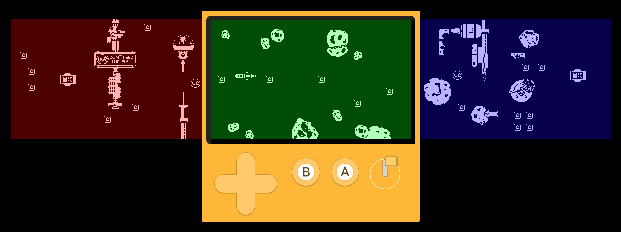
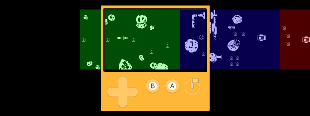
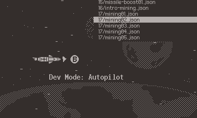

# How the game is architected

[Suborbital Salvage](/games/suborbital-salvage) has three major systems: GraphicRenderer, CollisionManager, EntityManager. Arguably you could consider the giant player and fish scripts as major systems too, but for the sake of this post on performance, neither of those really contribute much to the frame time. 

The __GraphicRenderer__ manages a list of graphics that it renders every frame. This is essentially my replacement for the SDK's [Sprite](https://sdk.play.date/Inside%20Playdate.html#C-graphics.sprite) system, tho I can't quite remember why I chose to roll my own system for this.

The __CollisionManager__ is responsible for managing colliders and checking for overlaps between them. The reason I chose to roll my own system was so I could support other collider shapes and non-AABB colliders. In the end I only added an additional circle collider shape, but I use circles extensively in the game. However I ended up not implementing non-AABB colliders as I didn't end up needing them (tho it came up late in development, but I decided it wasn't worth the risk to add that late).

The __EntityManager__ is charged with managing a list of entities, specifically adding, removing, and updating them every frame. An entity in the game is any individual object (an asteroid, a mine, a mushroom, etc). 

# Optimizations

## Use data driven design
_Note: This was an early design choice I made, not an optimization I made later in development._

I opted to not use an object oriented design, but instead a data driven one. This means every entity is just a table with plain old data e.g. position, rotation, graphic, collider, etc.

For example, here's the definition for a common asteroid:

```lua
entityDefinitions.asteroid = {
  colliders = {
    { type = collisionManager.COLLIDER_CIRCLE, x = 32, y = 32, radius = 24 },
  },
  graphics = {
    { id = "asteroid", x = 32, y = 32, layer = DEFAULT_OBSTACLE_LAYER, angle = 0 }
  },
  update = genericStaticObstacleUpdate
}
```

Since entities are not instances of a "class" (quoting the word "class" here since Lua doesn't natively have a concept of classes) they don't each have their own update method. This means there's only one update function that loops over every entity of a specific type. 

For example, here's the update method used to update all static entities every frame:
```lua
local function genericStaticObstacleUpdate(dt, entities)
  for i = 1, #entities, 1 do
    local e = entities[i]
    local colliders = e.colliders
    local count = #colliders
    for i = 1, count do
      local c = colliders[i]
      -- if there are contacts, the obstacle only collided with the larger player collider
      if c.hasContact then
        -- check if it collides with actual ship colliders
        if player.collides(c) then
          player.triggerCrash(e)
          return
        end
      end
    end
  end
end
```

Why do this? Because calling a function is not free, especially when you're doing it hundreds of times per frame. In my tests I found that comparing invoking a function vs inlining the same code was nearly 60% faster!

I wouldn't worry about this in less critical areas e.g. if calling a function only once per frame, the performance benefit of inlining it would be negligible. However in the case of Suborbital Salvage's EntityManager, there's typically around 200 entities at any given time so this was well worth the effort.

## Switch from arrays to linked lists
This one surprised me. Usually I lean on arrays to leverage the speed boost granted by [data locality](https://gameprogrammingpatterns.com/data-locality.html). However when comparing performance of an array to a linked list, there seemed to be little difference. I haven't done the research to understand why this is the case, but certainly a topic I want to explore another day!

After learning this I decided switch to [doubly linked lists](https://www.geeksforgeeks.org/doubly-linked-list/) in the GraphicRender and EntityManager. This is because one of the major performance issues I was seeing was single frame hitching when chunks with a high entity count were removed. Like this one (which has ~80 entities):


But circling back: why were arrays so costly in this situation? Well specifically for the graphic renderer this meant that when using an array, I had to search the array for the graphic I wanted to remove in order to obtain it's index to pass to `table.remove()`. If I needed to do this a hundred times, it added up quickly. 

When I implemented the linked list, I decided to give every graphic a `previous` and `next` variable to store the next and previous graphics in the list. Now when I want to remove a graphic, I don't need to search the list to find it, I simply assign `self.previous.next=self.next` and assign `self.next.previous = self.previous` and its removed!

## Add entities over time
Even with linked lists, adding entities was still causing some hitching. The actual adding of elements from the list wasn't the main contributor, but just all the logic involved with figuring out which entity needed to be added, the graphic, position, collider, etc.

I spent some time just trying to make all of that logic faster, but in the end I decided to use a common trick of just spreading an expensive operation over multiple frames. This was a HUGE boost! 

This could be a bad idea, as in other games you could wind up with pop-in as chunks are loaded. However, in Suborbital Salvage always has 3 chunks loaded:



Once you've completely left a chunk, its unloaded and a new one is appended after the next one:



This means we always have at least a chunks worth of time to load in objects, which ended up being plenty! I was able to get the number of entities processed per frame to 4. 

Although if you use the dev tools to skip to more entity heavy chunks, you do see some pop in 🙈



## Expose a collidable flag
- Many chunks had overlapping entities, which means some of those colliders were redundant. Exposed flag to reduce amount of colliders.

## Only check colliders that are immediately around the player
- Player doesn't move along the x, so we can limit collision checks to area around player.
- Player has three circle colliders and an larger collider
  - Larger collider is checked first before examining collisions with smaller colliders

## Limit function use in performance critical areas
- Leveraging macros from Playbit to inline functions.
- Use `image[frame]` instead of `image:getFrame(frame)`

## Trim extra data from chunks
- Load times

## Small wins
- Limiting function use in performance critical areas. Leveraging macros from Playbit.
- Saving table properties to a local variable when accessed more than once.
- Adding a developer "autopilot mode"