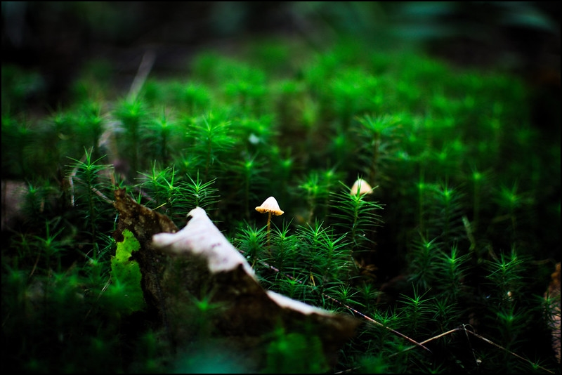

I enjoy writing and sharing knowledge, but I've always had a hard time finding regular time to do it. The [digital garden](https://maggieappleton.com/garden-history) philosophy allows me to share knowledge in an iterative way and without committing a bunch of time up front.

There is no chronological post history. Articles aren't always refined, or even complete. Content is always evolving. This garden is imperfect by design. [Learn more on how the garden is organized](organizing-the-garden).

I'll primarily focus on game development related topics, but I'll probably stray a bit from that path from time to time.

<!-- TODO: Trails section -->

# Recently planted


# Recently tended


<!-- TODO: a list of evergreen articles once I have a nice backlog -->