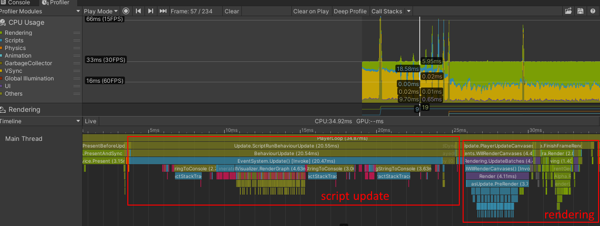

When I dove into optimizing my first Unity game years ago, there were plenty of resources that explained _what_ I should optimize, but nothing really about the _how to identify_ problems. Sure, the obvious first symptom is usually a jittery FPS, but that only clues you into the problem exists. How do you determine the root problem?

# Getting a baseline

The first thing I do is make a [development build]() for the device in question and get the [Unity profiler]() connected. It's important to profile on device (desktop, phone, console, etc) and _not_ in the editor. While there's some situations where you'd benefit from the quick iteration of profiling the editor, there are often too many caveats that will make it harder to real problems.

If I have a specific area that I'm trying to troubleshoot, I'll run thru the repro conditions with the profiler connected. Otherwise if I'm just doing some exploratory testing, then I'll just capture a few seconds of the core gameplay.

Unity's profiler window defaults to capturing a max of 300 samples, but you can [increase this up to 2000 frames](https://docs.unity3d.com/Manual/ProfilerWindow.html#preferences). Just keep in mind that more samples means larger snapshots.

Then a very important step: I save the snapshot the disk so I can always refer back to it as a baseline. Without it, I have no quantifiable way to determine how much impact my optimizations are making. Eyeballing FPS counters only gets you so far.

I also find it useful to record another snapshot with [deep profiling]() enabled. I usually capture a shorter period of time, primarily because Unity starts to slow down with large deep profiling snapshots. Your mileage may vary depending on your system specs and project size/complexity.

# Analyzing the data

Once I've gather my baseline snap shots, I load up the snapshot with deep profiling disabled. Using the [timeline view]() I can get a high-level view of where the game is spending the most time. 

There's two main categories of markers you'll see: script update and rendering markers.

There's no best balance of these two categories and depends heavily on the game. Something leaning more heavily into visual effects will spend more time rendering, where as something learning more into simulation will spend more time in script updates.

More time spent in `BehaviorUpdate` usually means I'll be poking around in scripts, while more time in FinishFrameRendering markers means I'm poking around in shaders and adjusting materials.

By default, Unity gives you a very shallow view into your game, so at this point I usually flip to the snapshot with deep profiling enabled.

<!--  -->

Its important to note that deep profiling looks at _everything_ and will further degrade the performance of your game. Don't concern yourself with the exact milliseconds but rather the relative amount of time a functions takes in respect to the total frame time.

# Analyzing results

<!-- 
- deep profiling
- custom markers
- analyzing optimizations with the memory profiler
- [Unity Profiler](https://docs.unity3d.com/Manual/Profiler.html)
- [Unity Frame Debugger](https://docs.unity3d.com/Manual/FrameDebugger.html)
- [Unity Profiler Analyzer](https://docs.unity3d.com/Packages/com.unity.performance.profile-analyzer@0.4/manual/profiler-analyzer-window.html)
- [Unity Memory Profiler](https://docs.unity3d.com/Packages/com.unity.memoryprofiler@1.0/manual/index.html)

- [Unity Docs: Common Profiler Markers](https://docs.unity.cn/Manual/profiler-markers.html)
- [Unity Docs: Performance Best Practices](https://docs.unity3d.com/Manual/BestPracticeUnderstandingPerformanceInUnity.html)
- [Unity Blog: Tales from Optimization Trenches](https://blogs.unity3d.com/2019/11/14/tales-from-the-optimization-trenches/)
- [Unity Blog: Scripting Optimizations](https://unity.com/how-to/advanced-programming-and-code-architecture?_ga=2.44000994.670872801.1603824943-1950255191.1583262306)
- [Unity Blog: Smart Game Development Pipeline](https://unity.com/how-to/set-smart-game-development-pipeline)
- [Unity Learn: Fixing Performance Problems](https://learn.unity.com/tutorial/fixing-performance-problems-2019-3?uv=2019.3#5e85bbb0edbc2a08897d4839)
- [Unity Learn: UI Optimization](https://create.unity3d.com/Unity-UI-optimization-tips)
- [Fix your Unity Timestep!](https://johnaustin.io/articles/2019/fix-your-unity-timestep)
- [Unity Job System](http://blog.s-schoener.com/2019-04-26-unity-job-zoo/)
- [Job System Tutorial](https://www.raywenderlich.com/7880445-unity-job-system-and-burst-compiler-getting-started)
- [Garbage Collection Tips](https://danielilett.com/2019-08-05-unity-tips-1-garbage-collection/)
- [GameDev Guru: Common optimizations](https://thegamedev.guru/unity-performance-checklist-pro/)
- [Your audio settings are killing your game!](https://blog.theknightsofunity.com/wrong-import-settings-killing-unity-game-part-2/) -->