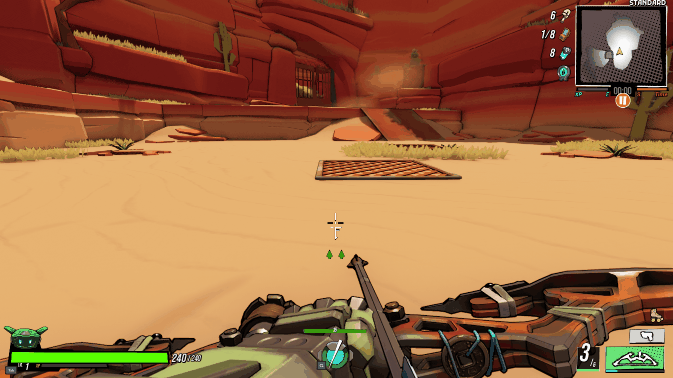

# Background
Since ~2021 I've been seeing a weird glitch on animated models in some games. Usually it was character animations, but sometimes it was other animated objects. When I first experienced it in [Deep Rock Galactic](https://store.steampowered.com/app/548430/Deep_Rock_Galactic/) - the camera rig would glitch and twitch the camera 90 degrees! <!-- TODO: Do I still have a video clip of this somewhere? -->

But in most cases, it was at most a distracting visual issue. For example, in [Robo Quest](https://store.steampowered.com/app/692890/Roboquest/) some weapons will flicker.

It's been driving me absolutely bonkers, but its been difficult to Google for. Generic searches of animation "flickering" or "stuttering" often results in hundreds of pages of Reddit/Steam posts of people trying to fix performance issues. This most definitely was not a performance issue - all affected games were running at a solid 60FPS.

However, over the weekend I finally realized it was only occurring in Unreal Engine games! 

# The problem

With that to narrow my search I discovered that it was because Unreal was running animation updates on e-cores on my CPU which was causing them to go out of sync. 

<!-- TODO: link to posts that led me to conclusion -->
<!-- 
What core do I have? Is there an official article about this?
https://www.reddit.com/r/intel/comments/17u7zdr/intel_fixes_ecores_for_gaming_doesnt_give_12th/
 -->

<!-- TODO: what are e-cores? why are they a problem? -->

# The solution
The fix was simply figuring out which cores were e-cores, then setting the game’s CPU affinity so it’s not allowed to use those cores
<!-- TODO: add Playnite script -->