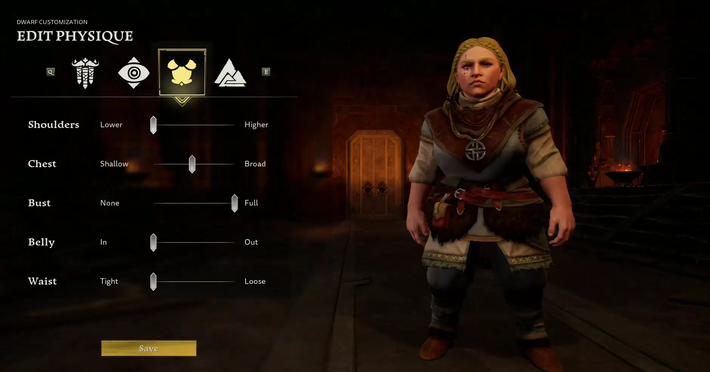
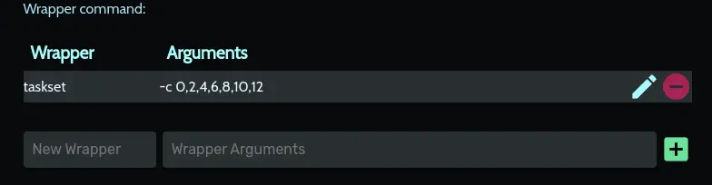

Since ~2021 I've been seeing a weird glitch on animated models in some games. When I first experienced it in [Deep Rock Galactic](https://store.steampowered.com/app/548430/Deep_Rock_Galactic/) - the camera rig would glitch and twitch the camera 90 degrees!

<!-- TODO: Do I still have a video clip of this somewhere? -->
_[insert lost video of the glitch in action here]_

But in most cases it was character animations that were just distracting visual issues. Twitchy walk cycles, flickering facial expressions, and etc. For example, in [Robo Quest](https://store.steampowered.com/app/692890/Roboquest/) some weapons will flicker:


In Lord of the Rings: Return to Moria characters twitch:



It's was driving me absolutely bonkers, but its been difficult to Google for. Generic searches of animation "flickering" or "stuttering" often results in hundreds of pages of Reddit/Steam posts of people trying to fix performance issues. This most definitely was not a performance issue - all affected games were running at a solid 60FPS.

# Researching the problem

I eventually was able to narrow down the problem to games made with Unreal Engine. Once I had that, I quickly came across [this similar issue someone was having in Fortnite](https://www.reddit.com/r/AMDHelp/comments/xlou5r/im_getting_player_model_flickering_in_unreal/). The entire thread was full of good clues, but [this particular comment](https://www.reddit.com/r/AMDHelp/comments/xlou5r/comment/kj8u32v/?utm_source=share&utm_medium=web3x&utm_name=web3xcss&utm_term=1&utm_content=share_button) helpfully summarized the problem as "The stuttering/warping of character models appears to be due to core multithreading desync". The fix was to simply change the CPU affinity for the game, tho I had to spend a bit of time testing to figure out which cores needed to be removed.

However I wasn't content with not understanding the root issue and why changing the CPU affinity fixed it, so I dove a bit deeper.

Unreal Engine has [an option to that toggles multithreaded animation updates](https://docs.unrealengine.com/4.27/en-US/AnimatingObjects/SkeletalMeshAnimation/Optimization/). When enabled, Unreal will run animation updates on a separate thread. At which point this got me wondering why particular cores were causing problems.

Turns out Intel processors have two types of cores built into the chip: efficiency cores (or E-cores) and performance cores (P-cores). You can find [much more detailed information about this tech on Intel's site](https://www.intel.com/content/www/us/en/gaming/resources/how-hybrid-design-works.html) but from what I understand: p-cores are good for games and e-cores are not-as-good for games. 

My educated guess is that when you run a mulithreaded game made in Unreal across both types of cores you get this weird desynchronization. My gaming rig is also still rocking an old i7 8700, so I suspect newer CPUs aren't subject to this problem and why it wasn't easy to find others with the same issue. Possibly because [Intel's Application Optimization (APO)](https://www.intel.com/content/www/us/en/support/articles/000095419/processors.html#:~:text=Intel%C2%AE%20Application%20Optimization%20determines,improve%20performance%20for%20supported%20applications.) is only available on 12th gen and newer? 

However at this point it was 10pm and I just wanted to implement a fix so I could actually play a run of Robo Quest, so I left that research for another day.

# My solution
As I mentioned earlier, the fix was to set the CPU affinity so that the game didn't use e-cores. However, the Reddit thread had instructions for doing it _manually_ which I had to do _every_ time the game booted. Nope, not doing that.

Thankfully you can set a process's affinity via Powershell, and [Playnite](https://playnite.link/) let's you [launch games with custom powershell scripts](https://api.playnite.link/docs/manual/library/games/gameActions.html)!

I first had to figure out how to launch Steam games via command line, since I couldn't rely on Playnite to launch it for me like it normally does. I ended up just [launching Steam with a deeplink to the game](https://developer.valvesoftware.com/wiki/Steam_browser_protocol). Unfortunately I couldn't figure out how to get the game's name and id via CLI from Steam or Playnite, so I manually fished those values out of the game folder. Unfortunate, but its a one time thing (and now its like 11pm).

The final step was figuring out how to set the CPU affinity. It took me a bit to figure out what hex value to pass to [ProcessorAffinity](https://learn.microsoft.com/en-us/dotnet/api/system.diagnostics.process.processoraffinity?view=net-8.0). Thanks to [this Stack Overflow thread](https://stackoverflow.com/questions/19187241/change-affinity-of-process-with-windows-script), I was able to work out that I needed to map each core to a bit in an 8-bit mask, then convert that binary number to a hex value. In other words, Core 1 = `0x10000000`, Core 2 = `0x01000000`, Core 3 = `0x00100000`, and etc. So if I wanted to use all cores except Core 1 and Core 2, my bit mask would be `0x00111111` which is `3F` in hexadecimal.

With all that, I was able to create the below script which is now the default launch action for Robo Quest in Playnite. Plus I could just copy it to the other games that were having similar problems 🎉

```powershell
# the game's steam id
$gameId = "692890"

# process name - the name of the EXE (usually) with '-Win64-Shipping' appended
$gameProcessName = "RoboQuest-Win64-Shipping"

# launch game thru steam so overlay works
$pinfo = New-Object System.Diagnostics.ProcessStartInfo
$pinfo.FileName = "C:\Program Files (x86)\Steam\steam.exe"
$pinfo.Arguments = "steam://rungameid/" + $gameId
$p = New-Object System.Diagnostics.Process
$p.StartInfo = $pinfo
$p.Start()

# wait for game to start
Start-Sleep 5

# get game process and set affinity
$game = Get-Process -Name $gameProcessName
$game.ProcessorAffinity=0x3F
Wait-Process $game.id
```

# Resolving the problem on Ubuntu

I decided in 2025 to switch from Windows to Ubuntu, but on the same hardware where the problem still persisted. However setting the CPU affinity proved to be _much_ easier, and only required calling a single command [taskset](https://man7.org/linux/man-pages/man1/taskset.1.html).

However one complication was that setting the CPU affinity _after_ the game launched 

The weird part was that the cores I needed to disable were different under Ubuntu vs Windows 11. Instead of just disabling cores 1 and 2, I had to disable all even-numbered cores.

For Steam games this was a simple as adding `taskset -c 0,2,4,6,8,10,12 %command%` for the [launch options](https://help.steampowered.com/en/faqs/view/7D01-D2DD-D75E-2955) for each game.

For non-Steam games (e.g. Epic, Amazon, GOG) I use [Heroic Games Launcher](https://heroicgameslauncher.com/) and found it was also just as simple as adding the same command as a wrapper command for the game:
taskset
-c 0,2,4,6,8,10,12
