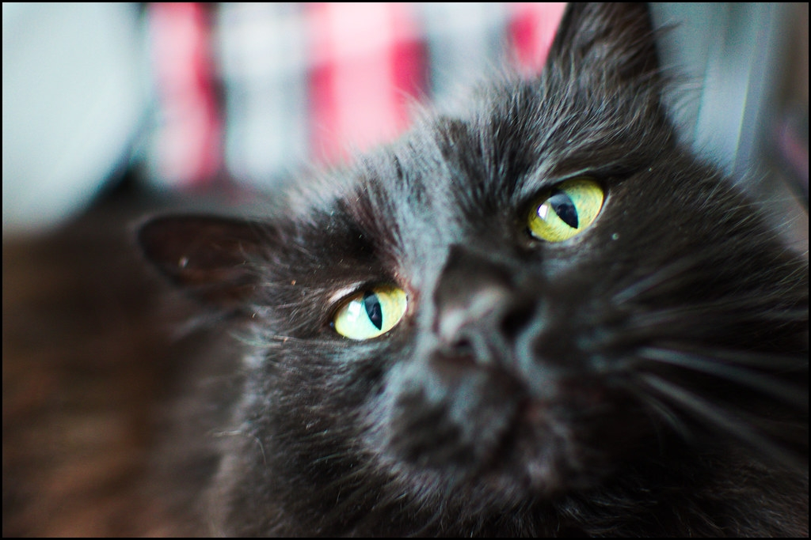

Games Right Meow is an __independent game studio__ and __game development consultancy__. It was founded in 2023 by industry veteran [Alex Larioza](https://alexlarioza.com). 

Alex has over 10 years of experience building games and other interactive media, culminating in 30+ shipped projects. His primary focus is on programming, but he also dabbles in game design, pixel art, and sound effects.

When he's not staring at a screen, he enjoys eating delicious food, petting cats, and exploring the great outdoors. Did I mention he also loves food? 🍕

